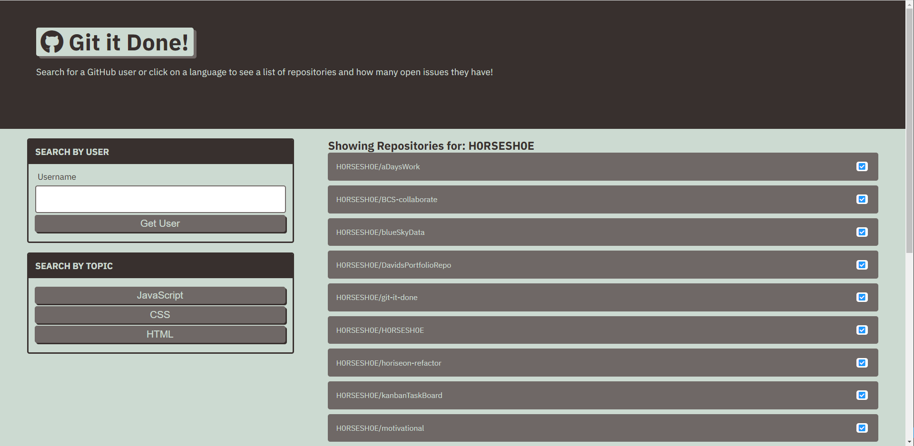

# <Your-Project-Title>Git It Done
## U of T Coding Boot Camp: Module Project #6 
### [Installation](#installation)  - [Usage](#usage)  - [Credits](#credits)  - [License](#license) - [Features](#Features)
&nbsp;
## Description
It is a functional application for a practical purpose of examining the featured repositories on GitHub which have open issues relating to JavaScript, HTML or CSS.  It also allows its' user to query the open issues of particular users repositories.  

The following is a short description of my experience completing the project:
- I really enjoyed the integration of server-side APIs into my application.  It seems that each week is more exciting than the last - the tools are so powerful!
- It is vital to focus first on achieving a minimum viable product (MVP) when coding.  I have struggled to regain my footing in the course since I attempted to create an application that delivered a good deal more than was required and 'life happened' at the same time.
- I had to rush through the next week which made studying that material very difficult and I still do not feel secure in my grasp of it.
- But, I feel I have begun to find the rhythm of the pace of the course and I feel I will be back in step soon. 

## Installation
To set up the website:
 - upload all of the files and directories to a host server or run this application from any folder on your personal computer by opening the index.html in your browser.
## Usage
Use this application to quickly find and navigate to repositories with open issues on GitHub to help out and build your coding skills!  A tool like this would also be good for instructors and their assistants to keep track of the progress being made by their students who are uploading their work to GitHub.

See it online now at: [https://h0rsesh0e.github.io/git-it-done/]

## Credits
This is was the application I built in the 6th module of the Coding Boot Camp provided by [The School of Continuing Studies, University of Toronto](https://learn.utoronto.ca/) and [Trilogy Education Services](https://www.trilogyed.com/). 

## License
All content is the exclusive property of Trilogy Education Services and or The School of Continuing Studies, University of Toronto.

## Features
The application has a simple user interface 

&nbsp;

&nbsp;

**H0RSESH0E**
